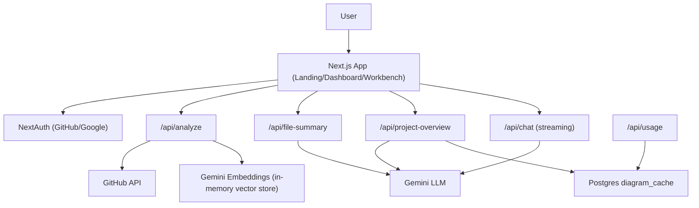

# gitlore

AI-assisted repository narrator built with Next.js App Router and Gemini. Paste a GitHub URL, sign in, and gitlore delivers repo-level overviews, hotspots, file-by-file summaries, and Mermaid diagrams, plus a RAG-backed chat tied to the file you are viewing.

## What the app does
- Analyzes GitHub repos with Gemini: elevator pitch, stack radar, hotspots, file summaries, and diagrams.
- Surfaces: landing (`HeroLanding`), dashboard (`CockpitDashboard` + `ProjectOverview`), and workbench (`DeepDiveExplorer`) with code viewer + per-file explanations and diagrams. `OmniChat` provides contextual Q&A.
- Enforces per-user usage metering (tokens + request counts) with UI display (`UsageIndicator`/`UsageModal`).

## Architecture (high level)
- **Frontend:** Next.js 16 (App Router), React 19, TypeScript, framer-motion, lucide-react, recharts (radar), reactflow, Monaco editor, Mermaid renderer, react-resizable-panels, ReactMarkdown. Styling via utility classes in `globals.css`.
- **Auth:** NextAuth (GitHub/Google) with custom sign-in page at `/api/auth/signin`.
- **Backend APIs:** Next.js route handlers (see below) orchestrate GitHub fetches, Gemini calls, caching, and token accounting.
- **Data:** Postgres (optional) for `diagram_cache` and `token_usage`; in-memory diagram cache; in-memory vector store using Gemini embeddings (`text-embedding-004`).

## Key flows & API routes
- `POST /api/analyze` — Validate GitHub URL, fetch repo metadata/README, fetch a subset of files, build hotspots, embed code snippets, and ask Gemini for elevator pitch + stack radar. Returns `repoId`, sample/full file tree, hotspots, and sample code.
- `POST /api/project-overview` — Given owner/name/tree/sampleCode, prompts Gemini for overview, architecture, key components, data flow, tech stack, dependencies, and two Mermaid diagrams. Caches in memory and persists to Postgres via `diagramStore`.
- `POST /api/file-summary` — Fetches a raw file from GitHub, truncates, and prompts Gemini for markdown summary + Mermaid diagram.
- `POST /api/chat` — Streams Gemini responses; can include RAG context from the in-memory vector store and the current file content.
- `POST /api/index-repo` — Stubbed placeholder; returns a queued `jobId`.
- `GET /api/usage` — Returns per-user token/request usage from Postgres `token_usage`.

## Frontend experience
- **Dashboard:** Radar chart for stack balance, hotspots list, and project overview with diagrams (`ProjectOverview`).
- **Workbench:** File tree from returned file list; selecting a file calls `/api/file-summary`, caches client-side, shows read-only Monaco code, markdown summary, and Mermaid diagram; fullscreen toggles supported.
- **Chat:** Floating chat with optional file context and RAG results from embeddings.

## Tech stack & dependencies
- Next.js 16 (App Router), React 19, TypeScript.
- NextAuth for OAuth; Google Gemini API (`@google/generative-ai`) for chat/summarization/embeddings.
- Postgres via `pg`; recharts, mermaid, reactflow, framer-motion, lucide-react, Monaco editor, ReactMarkdown, react-resizable-panels.

## Environment & config
Required for core features:
- `GEMINI_API_KEY` — Gemini API key.
- `GEMINI_MODEL` — Optional; defaults to `gemini-2.5-flash`.
- `GITHUB_PAT` — Optional; raises GitHub rate limits.
- `DATABASE_URL` — Optional; enables Postgres persistence for diagrams/usage.
- `GITHUB_CLIENT_ID` / `GITHUB_CLIENT_SECRET`
- `GOOGLE_CLIENT_ID` / `GOOGLE_CLIENT_SECRET`
- Optional vector store placeholders: `VECTOR_DB_URL`, `VECTOR_DB_KEY`, `VECTOR_DB_PROVIDER`.

Rate limits (enforced in `tokenUsage.ts`):
- 50k tokens/day, 100 requests/day, 10 requests per 60s window per user.

## Running locally
1) Install deps: `npm install`  
2) Copy `.env.local.example` (create if missing) to `.env.local` and fill required keys.  
3) Run dev server: `npm run dev`  
4) Open http://localhost:3000 and sign in via GitHub/Google.

## Repository layout (not exhaustive)
- `src/app` — App Router pages and API routes (`api/analyze`, `api/project-overview`, `api/file-summary`, `api/chat`, `api/usage`, auth).
- `src/components` — UI: landing, dashboard, workbench, chat, diagrams, auth, layout.
- `src/context` — `RepoContext`, `FileContext`.
- `src/lib` — Adapters for Gemini, GitHub, embeddings, token usage, diagram cache/store, vector store.
- `__tests__/landing.test.tsx` — Basic landing test (needs more coverage).

## Notable gaps / TODOs
- README was previously placeholder; broader docs welcome (deployment, security notes, UI screenshots).
- `/api/index-repo` is stubbed; background indexing pipeline not implemented.
- No external vector DB integration—embeddings live in-memory.
- Test coverage limited to landing page.

## Example architecture diagram (Mermaid)
